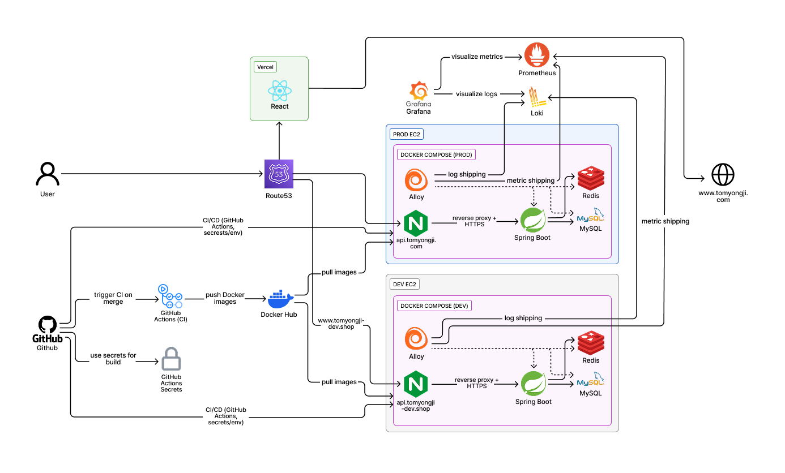
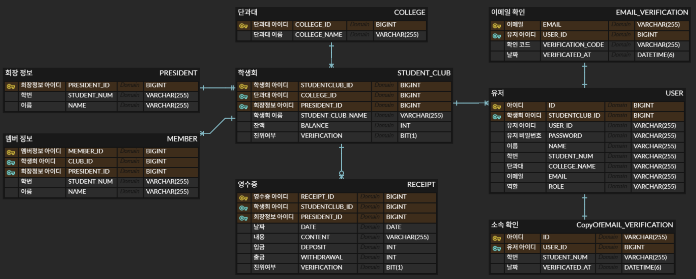

## ToMyongJi backend repository

### 💡 투명지 (To Myongji)

  

   

### 📌 프로젝트 소개
"To Myongji (명지대학교 학생들을 위해)" 투명지는 학생회비 집행 내역을 투명하게 공개하여 학생 사회의 신뢰를 회복하기 위한 학생회비 통합 관리 플랫폼입니다. 교내 횡령 사건을 계기로 기획되었으며 , 기존 엑셀 방식의 데이터 무결성 한계를 기술적으로 극복하고자 시작되었습니다.

### 🛠 기술 스택
🔧 Backend

### ⚙️ Ops

### 🛠 Collaboration

### 🏗 시스템 아키텍처

### 🚀 핵심 기술적 성과 (Technical Depth)
1. 데이터 무결성 확보 및 자동화 
   
   단순 CRUD를 넘어, 서비스 도입 장벽을 낮추고 신뢰도를 높이기 위해 4가지 업로드 파이프라인을 구축했습니다.

- Tossbank PDF 검증 (Trust): PDF 내 고유 번호를 파싱하여 진위 여부를 확인하고, 검증된 내역에 인증 마크를 부여하여 데이터 무결성 보장.
- AI OCR (Convenience): 모바일 영수증 이미지를 텍스트로 자동 변환하여 학생회 간부의 장부 작성 수고를 획기적으로 단축.
- Batch CSV Upload (Onboarding): 기존 엑셀 기반 장부 데이터를 한 번에 마이그레이션할 수 있도록 지원하여 신규 학생회의 서비스 도입 장벽 제거.
- 수기 입력 (Basic): 예외 케이스를 대비한 기본적인 직접 입력 기능 제공.

2. 고성능 조회 및 캐싱 전략
- 캐시 적중률 최적화: 조회 속도 향상을 위해 페이징(Pagination) 처리를 수행하고, 캐싱 단위를 페이지별로 세분화하여 캐시 적중률(Hit Rate)을 높였습니다.
- Cache Stampede 방지: Redis 적용 시 sync = true 설정을 활용하여, 전교생 동시 접속 시 발생하는 대량의 DB 부하(Cache Miss 상황)를 1회의 조회로 최소화했습니다.
- 복합 인덱스 적용: (student_club_id, date DESC, id DESC) 인덱스로 filesort 비용을 제거하고 t3 인스턴스의 자원 효율성을 극대화했습니다.

3. 인프라 모니터링 및 비용 최적화 (FinOps)
- RDS to MySQL Container 마이그레이션: AWS 정책 변화에 대응하여 RDS 대신 EC2 내 Docker MySQL 환경으로 이전함으로써 유지 비용을 50% 이상 절감했습니다.
- Alloy 기반 통합 매트릭 수집: Grafana Alloy를 활용해 Prometheus 매트릭(CPU, RAM)과 Loki 로그를 동시에 수집하여 인프라 가용성 실시간 모니터링을 구현했습니다.
- OOM 방지: 저사양 t3.micro 환경에서 가용 RAM 확보를 위해 리눅스 Swap 메모리를 3GB로 증설하고 리소스 할당을 최적화했습니다.

4. 코드 품질 및 안정성 (Reliability)
- 테스트 코드 자동화: * 단위 테스트(Unit Test): JUnit5와 Mockito를 활용하여 서비스 레이어의 비즈니스 로직을 독립적으로 검증.
- 통합 테스트(Integration Test): API 엔드포인트부터 DB 연동까지의 전체 프로세스를 검증하여 배포 안정성 확보.
- 감사(Audit) 시스템: 데이터의 생성/삭제 자율성은 보장하되, 수정 및 삭제 발생 시 로그를 통해 이력을 추적하는 투명한 감시 체계 구축.

### ✨ 주요 기능
📊 영수증 관리 시스템
- 자동 검증 등록: 토스뱅크 PDF 파싱 및 AI OCR을 통한 자동 기입.
- 데이터 추출: 월별 장부 데이터 CSV 다운로드 기능.
- 페이징 조회: Redis 캐싱이 적용된 고성능 영수증 목록 조회.

👥 소속 인증 및 보안
- 인가 시스템: 회장 및 부원 정보를 관리자가 사전에 등록하여 소속 매칭 후 가입 허용 .
- 로그 추적: Grafana Loki를 통한 민감 액션(수정/삭제) 실시간 로깅 및 감사.

### 📈 성능 개선 지표 (VU 200 기준)
| 지표 | 개선 전 (Full Scan) | 개선 후 (Index + Cache) | 개선 효과 |
| :--- | :--- | :--- | :--- |
| **DB CPU 사용률** | 23.8% | **0.42%** | **약 98% 감소** |
| **평균 응답 시간** | 254ms | **20.2ms** | **약 12.5배 향상** |
| **처리량 (Iterations)** | 7,955회 | **9,780회** | **약 23% 증가** |

### 🗄 데이터베이스 설계 (ERD)
